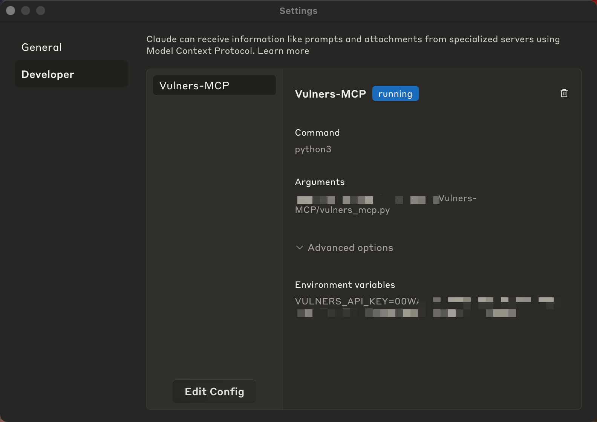
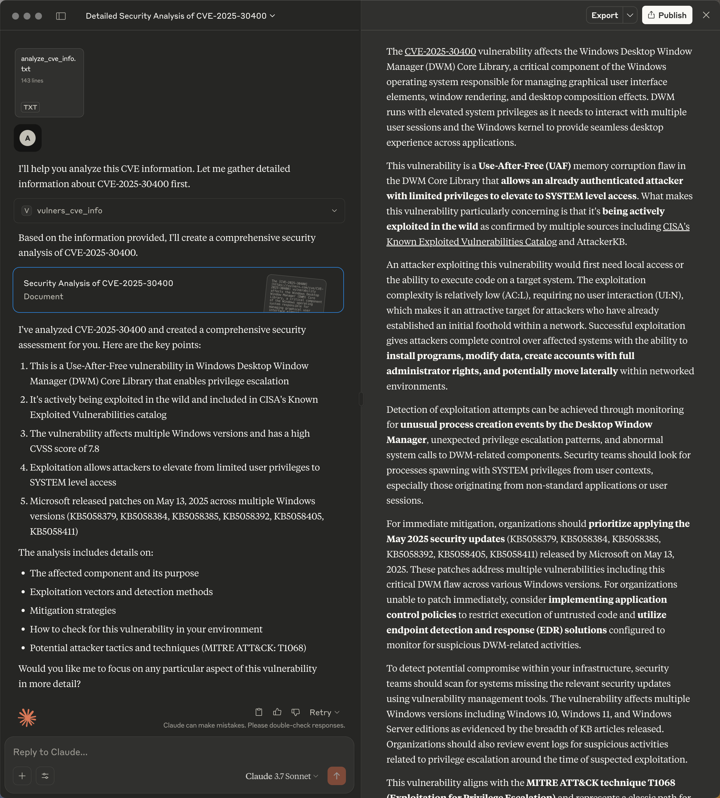
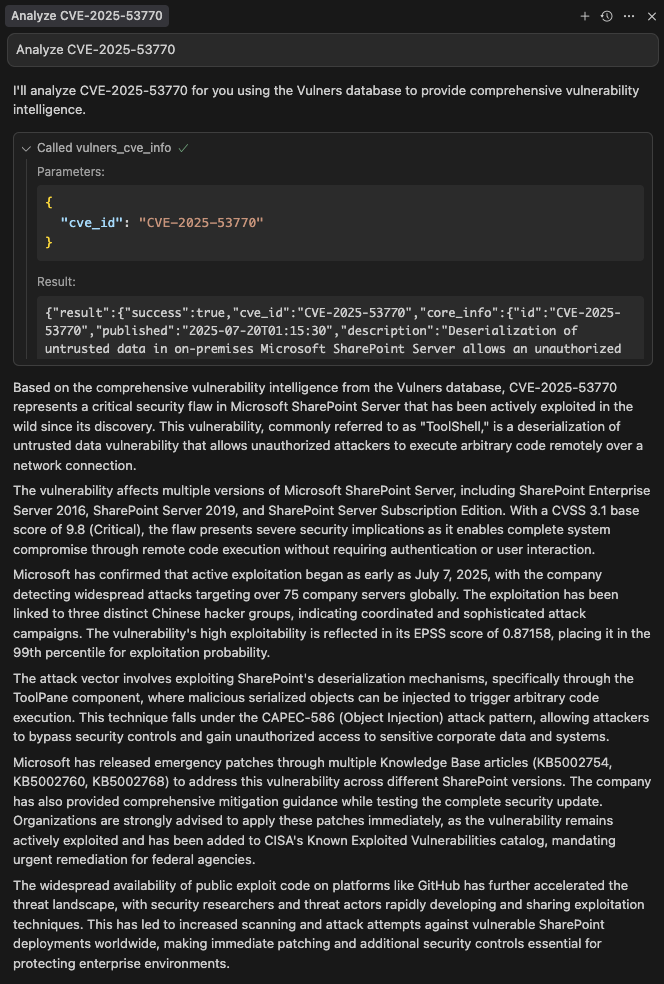
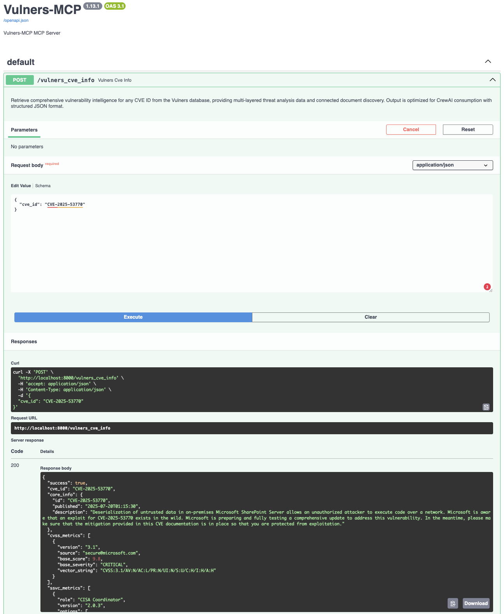

# Vulners-MCP

The Vulners MCP is a server designed to retrieve CVE details and information about related documents using the Vulners API. It provides users with comprehensive vulnerability intelligence, including CVE description, CWEs, CVSS score, EPSS score and percentiles, references, exploitation status, and more, all in one place.

## Features

- **Comprehensive CVE Information**: Fetch detailed vulnerability data, including description, CWEs, CVSS score, EPSS, and exploitation status, directly from the Vulners API.
- **Comprehensive References**: Retrieve a comprehensive collection of documents that reference the CVE from over 200 sources aggregated in the Vulners database.
- **MCP Server**: Serve data through a robust and extensible MCP server for seamless integration with other tools.
- **Docker Support**: Easily deploy the server using Docker for a consistent and portable runtime environment.
- **Cursor Compatibility**: Integrate with Cursor MCP for enhanced developer workflows.

## Prerequisites

- Python 3.13 or higher
- Docker (optional, for containerized deployment)
- A Vulners API key (add it to the environment as `VULNERS_API_KEY`)

## Setup Instructions

### 1. Clone the Repository

```bash
git clone <repository-url>
cd Vulners-MCP
```

### 2. Install Dependencies

```bash
pip install -r requirements.txt
```

### 3. Add Your Vulners API Key

Get your Vulners API key on the Vulners website by following the [instructions](https://vulners.com/docs/api_reference/apikey/). You can create a free account with any email address.

To add the Vulners API key to the environment, you can create a `.env` file in the project root and specify your Vulners API key:

```env
VULNERS_API_KEY=your-vulners-api-key
```

## Using with Claude Desktop and Cursor

### 1. Configure Vulners MCP Server

Claude Desktop is the easiest way to start using the MCP server. You need to configure it in `claude_desktop_config.json`. To find it, go to **Claude > Settings > Developer > Edit Config**. Add the following configuration, including the API key.

```json
{
    "mcpServers": {
        "Vulners-MCP": {
            "command": "python3",
            "args": [
                "Vulners-MCP/vulners_mcp.py"
            ],
            "env": {
                "VULNERS_API_KEY": "your-vulners-api-key"
            }
        }
    }
}
```

**Note**: Make sure to update the `args` path to match the location of the `vulners_mcp.py` file on your local machine and to update `env` with your actual Vulners API key.

Restart Claude Desktop. Your configuration should look like this:



### 2. Vulners_CVE_Info MCP Tool

When asked about a CVE, Claude reliably invokes the MCP server tool to get information about the CVE.


### 3. Vulners MCP Prompt

You can also add a specialized prompt from Vulners MCP to a Claude chat to guide the CVE analysis.



### 4. Configuring and using Vulners MCP Server in Cursor

You can use exactly the same MCP configuration to add Vulners MCP to Cursor. To do that, go to **Cursor > Settings > Cursor Settings > MCP > Add new global MCP server** and update `mcp.json` accordingly.

After that, you can get info about a CVE right in your development environment. The models' settings appear to make responses very precise, but this is still useful for rapid development iteration.



## Docker Deployment

If you want to run the Vulners MCP server in Docker, follow these steps:

### 1. Build the Docker Image

To build the Docker container, run:

```bash
docker build -t vulners_mcp .
```

### 2. Run the Docker Container

Run the container and expose it on port `8000`:

```bash
docker run -p 8000:8000 -e VULNERS_API_KEY=your-vulners-api-key vulners_mcp
```

The MCP server will now be accessible at `http://localhost:8000`.

### Swagger Screenshot

Below is a screenshot of the MCP server API test via [Swagger UI](http://localhost:8000/docs):



## Project Structure

```text
Vulners-MCP
├── vulners_mcp.py          # Main entry point for the MCP server
├── vulners_mcp_test.py     # Test script for the MCP server
├── requirements.txt        # Project dependencies
├── Dockerfile              # Docker configuration
├── LICENSE                 # Project license information
├── .gitignore              # Git ignore rules
├── images/                 # Directory for images used in README
└── README.md               # Project documentation
```

## Contributing

Contributions are welcome! Please feel free to submit a pull request or open an issue for any enhancements or bug fixes.

## License

This project is licensed under the GNU AFFERO GENERAL PUBLIC LICENSE 3.0. See the [LICENSE](LICENSE) file for more details.
