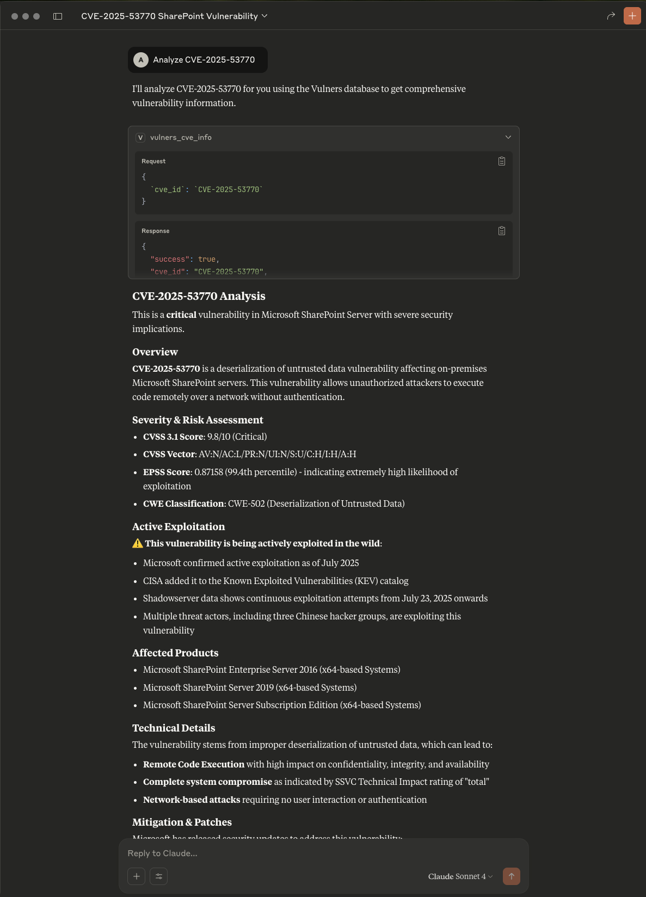

# Vulners-MCP

[](https://modelcontextprotocol.io) [](#docker-deployment) [](#swagger-screenshot) [](#docker-deployment) [](#prerequisites) [](LICENSE)


The Vulners MCP is a server designed to retrieve CVE details and information about related documents using the Vulners API. It provides users with comprehensive vulnerability intelligence, including CVE description, CWEs, CVSS score, EPSS score and percentiles, references, exploitation status, and more, all in one place.

## Features

- **Multi-Layered CVE Intelligence**: The `vulners_cve_info` tool provides comprehensive vulnerability analysis including:
  - **Core CVE Data**: Official CVE ID, publication date, title, and detailed description
  - **Multi-Source Risk Scoring**: CVSS v3.1/v4.0 scores from NVD and CNA sources, SSVC stakeholder decision support, and EPSS exploit prediction scores with percentile rankings
  - **Weakness Analysis**: CWE classifications with consequence analysis (security scopes and potential impacts) and related CAPEC attack patterns with cross-framework taxonomy mappings
  - **Exploitation Intelligence**: Real-world exploitation status with authoritative source attribution and timeline confirmation
  - **Affected Products**: Platform-aware product listings with intelligent vendor deduplication for precise asset inventory mapping
  - **Connected Document Discovery** (CVE tool only): Retrieve and analyze related security intelligence from 200+ sources including:
    - **Security Advisories**: Vendor patches, technical bulletins, and official remediation guidance  
    - **Vulnerability Chains**: Cross-referenced CVEs and dependency analysis for understanding broader attack surfaces
    - **Solutions Repository**: Combined remediation guidance from official CVE documents and various security intelligence sources
    - **Workarounds**: Temporary mitigations and alternative security measures when available

- **Security Bulletin Intelligence**: The `vulners_bulletin_info` tool provides essential bulletin information for non-CVE security documents including:
  - **Bulletin Metadata**: Official ID, publication date, title, and comprehensive description for GHSA, RHSA, NASL, and vendor advisories
  - **CVE Cross-References**: Complete list of CVE identifiers mentioned in bulletins for further analysis with the CVE tool
  - **Reference Links**: Official advisory URLs, vendor patches, and technical documentation sources
  - **Bulletin Classification**: Document type and classification for understanding advisory structure

- **JSON Output**: Structured JSON output optimized for CrewAI and automated processing
- **MCP Server**: Serve data through a robust and extensible MCP server for seamless integration with other tools.
- **Docker Support**: Easily deploy the server using Docker for a consistent and portable runtime environment.
- **Cursor Compatibility**: Integrate with Cursor MCP for enhanced developer workflows.

## Prerequisites

- Python 3.13 or higher
- Docker (optional, for containerized deployment)
- A Vulners API key (add it to the environment as `VULNERS_API_KEY`)

## Setup Instructions

### 1. Clone the Repository

```bash
git clone <repository-url>
cd Vulners-MCP
```

### 2. Install Dependencies

```bash
pip install -r requirements.txt
```

### 3. Add Your Vulners API Key

Get your Vulners API key on the Vulners website by following the [instructions](https://vulners.com/docs/api_reference/apikey/). You can create a free account with any email address.

To add the Vulners API key to the environment, you can create a `.env` file in the project root and specify your Vulners API key:

```env
VULNERS_API_KEY=your-vulners-api-key
```

### 4. Update CAPEC Attack Patterns Data (Optional)

The repository includes CAPEC Mechanisms of Attack view data (`1000.xml`) for enhanced vulnerability analysis. To ensure you have the latest attack pattern information, you can update this data by downloading a fresh view from [MITRE CAPEC](https://capec.mitre.org/data/xml/views/1000.xml.zip):

```bash
# Download the latest CAPEC data
wget https://capec.mitre.org/data/xml/views/1000.xml.zip

# Extract the archive to replace the existing file
unzip -o 1000.xml.zip

# Clean up
rm 1000.xml.zip
```

This update provides the most current CAPEC attack patterns and taxonomy mappings for comprehensive vulnerability analysis.

## Using with Claude Desktop and Cursor

### 1. Configure Vulners MCP Server

Claude Desktop is the easiest way to start using the MCP server. You need to configure it in `claude_desktop_config.json`. To find it, go to **Claude > Settings > Developer > Edit Config**. Add the following configuration, including the API key.

```json
{
    "mcpServers": {
        "Vulners-MCP": {
            "command": "python3",
            "args": [
                "Vulners-MCP/vulners_mcp.py"
            ],
            "env": {
                "VULNERS_API_KEY": "your-vulners-api-key"
            }
        }
    }
}
```

**Note**: Make sure to update the `args` path to match the location of the `vulners_mcp.py` file on your local machine and to update `env` with your actual Vulners API key.

#### Optional: Enable Debug Mode

For troubleshooting and analysis purposes, you can enable debug mode by adding the `DEBUG` environment variable to your configuration:

```json
{
    "mcpServers": {
        "Vulners-MCP": {
            "command": "python3",
            "args": [
                "Vulners-MCP/vulners_mcp.py"
            ],
            "env": {
                "VULNERS_API_KEY": "your-vulners-api-key",
                "DEBUG": "true"
            }
        }
    }
}
```

When debug mode is enabled:

- **Detailed Logging**: Enhanced logging output for troubleshooting API calls and data processing
- **Debug Output Files**: Tool responses are automatically saved as `vulners_mcp_output_{CVE-ID}.json` files in the project directory
- **Development Support**: Useful for analyzing tool behavior and validating output format

#### Sample Output Structure

The tools now return structured JSON output optimized for CrewAI and automated processing. Here are examples of the output structure:

**CVE Analysis Tool JSON Output:**

```json
{
  "success": true,
  "cve_id": "CVE-2021-44228",
  "core_info": {
    "id": "CVE-2021-44228",
    "published": "2021-12-10T20:15:00.000Z",
    "description": "Apache Log4j2 2.0-beta9 through 2.14.1 JNDI features used in configuration, log messages, and parameters do not protect against attacker controlled LDAP and other JNDI related endpoints..."
  },
  "cvss_metrics": [
    {
      "version": "3.1",
      "source": "NVD",
      "base_score": 10.0,
      "base_severity": "CRITICAL",
      "vector_string": "CVSS:3.1/AV:N/AC:L/PR:N/UI:N/S:C/C:H/I:H/A:H"
    }
  ],
  "epss_score": {
    "score": 0.999,
    "percentile": 99.9,
    "date": "2021-12-10"
  },
  "cwe_classifications": ["CWE-502"],
  "exploitation_status": {
    "wild_exploited": true,
    "sources": ["CISA", "Shadowserver"]
  },
  "affected_products": [
    "Apache Log4j 2.x for Java",
    "Apache Log4j 2.x for Windows"
  ],
  "solutions": [
    "Update to Apache Log4j 2.17.0 or later",
    "Apply vendor patches immediately"
  ],
  "related_cves": ["CVE-2021-45046", "CVE-2021-45105"]
}
```

**Security Bulletin Tool JSON Output:**

```json
{
  "success": true,
  "bulletin_id": "GHSA-1234-5678-9abc",
  "core_info": {
    "id": "GHSA-1234-5678-9abc",
    "type": "GHSA",
    "published": "2021-12-10T20:15:00.000Z",
    "description": "Critical vulnerability in Apache Log4j affecting multiple products..."
  },
  "related_cves": ["CVE-2021-44228", "CVE-2021-45046"]
}
```

**Error Response Format:**

```json
{
  "success": false,
  "error": "VULNERS_API_KEY not configured. Please set VULNERS_API_KEY environment variable.",
  "cve_id": "CVE-2021-44228"
}
```

The JSON structure provides easy access to specific fields for automated processing and CrewAI integration.

#### Benefits of JSON Output

- **Structured Data Access**: Easy field extraction like `result["cvss_metrics"][0]["base_score"]`
- **Type Safety**: Clear field types and structure for reliable processing
- **Error Handling**: Consistent JSON error format with `success: false`
- **CrewAI Integration**: Optimized for CrewAI agent workflows and automated processing
- **Field Selection**: Direct access to nested data without parsing
- **Array Handling**: Lists of solutions, affected products, etc. are properly structured

#### Example Usage

```python
# CVE Info Tool
result = await vulners_cve_info("CVE-2021-44228")
if result["success"]:
    cve_id = result["cve_id"]
    description = result["core_info"]["description"]
    cvss_score = result["cvss_metrics"][0]["base_score"]
    affected_products = result["affected_products"]
    solutions = result["solutions"]
else:
    error = result["error"]

# Bulletin Info Tool
result = await vulners_bulletin_info("GHSA-1234-5678-9abc")
if result["success"]:
    bulletin_id = result["bulletin_id"]
    title = result["core_info"]["title"]
    related_cves = result["related_cves"]
else:
    error = result["error"]
```

Restart Claude Desktop. Your configuration should look like this:


### 2. Vulners MCP Tools

The Vulners MCP server provides two powerful tools for vulnerability intelligence:

#### CVE Analysis Tool (`vulners_cve_info`)

When asked about a CVE, Claude reliably invokes the MCP server tool to get comprehensive information about the CVE, including CVSS scores, exploitation status, affected products, and related documents.

#### Security Bulletin Tool (`vulners_bulletin_info`)

For non-CVE security bulletins (GHSA, RHSA, NASL, advisories), Claude can retrieve essential bulletin metadata including publication details, descriptions, reference links, and most importantly, the CVE identifiers mentioned in the bulletin. This tool is designed to extract basic bulletin information and identify related CVEs that can then be analyzed in detail using the CVE analysis tool.



Both tools provide structured JSON output optimized for CrewAI and automated processing. The CVE tool enables comprehensive vulnerability analysis reports with easy field access, while the bulletin tool helps identify and cross-reference CVEs mentioned in security advisories for further detailed analysis.

### 3. Configuring and using Vulners MCP Server in Cursor

You can use exactly the same MCP configuration to add Vulners MCP to Cursor. To do that, go to **Cursor > Settings > Cursor Settings > MCP > Add new global MCP server** and update `mcp.json` accordingly.

**Note**: The same `DEBUG` environment variable option described above works with Cursor as well. Simply include `"DEBUG": "true"` in the `env` section of your `mcp.json` configuration to enable debug mode and automatic output file generation.

After that, you can get comprehensive CVE vulnerability intelligence and extract bulletin information with CVE cross-references right in your development environment. The models' settings appear to make responses very precise, but this is still useful for rapid development iteration and security analysis.


## Docker Deployment

If you want to run the Vulners MCP server in Docker, follow these steps:

### 1. Build the Docker Image

To build the Docker container, run:

```bash
docker build -t vulners_mcp .
```

### 2. Run the Docker Container

Run the container and expose it on port `8000`:

```bash
docker run -p 8000:8000 -e VULNERS_API_KEY=your-vulners-api-key vulners_mcp
```

The MCP server will now be accessible at `http://localhost:8000`.

#### Updating CAPEC Data with Docker

The Docker build process automatically updates the CAPEC attack patterns data (`1000.xml`) during build time. To get the latest CAPEC data when using Docker, simply rebuild the image.

Rebuilding Docker images regularly is a good security practice as it also incorporates the latest base image updates and dependency patches, keeping your deployment secure and up-to-date.

### Swagger Screenshot

Below is a screenshot of the MCP server API test via [Swagger UI](http://localhost:8000/docs):


## Project Structure

```text
Vulners-MCP/
├── vulners_mcp.py              # Main MCP server implementation
├── requirements.txt            # Python dependencies
├── Dockerfile                  # Docker configuration for containerized deployment
├── .dockerignore               # Docker build context exclusions
├── .gitignore                  # Git version control exclusions
├── LICENSE                     # GNU AFFERO GPL v3.0 license
├── README.md                   # Project documentation
├── 1000.xml                    # CAPEC attack patterns data
├── images/                     # Documentation screenshots and diagrams
│   ├── Claude_MCP_Configuration.png
│   ├── Claude_MCP_Tool_Usage.png
│   ├── Cursor_MCP_Tool_Usage.png
│   ├── Vulners-MCP_Swagger_UI.png
│   └── banner.png
├── vulners_mcp_output_CVE-2025-53770.json   # Sample: SharePoint vulnerability analysis (JSON format)
├── vulners_mcp_output_CVE-2025-31205.json   # Sample: WebKit vulnerability analysis (JSON format)
└── vulners_mcp_output_CVE-2025-7395.json    # Sample: OpenSSL vulnerability analysis (JSON format)
```

## Contributing

Contributions are welcome! Please feel free to submit a pull request or open an issue for any enhancements or bug fixes.

## License

This project is licensed under the GNU AFFERO GENERAL PUBLIC LICENSE 3.0. See the [LICENSE](LICENSE) file for more details.
